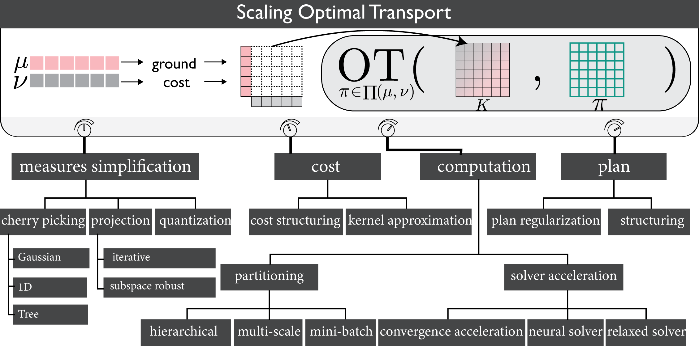

# Scalable Optimal Transport Methods in Machine Learning

A curated list of research works and resources on optimal transport in machine learning. 
Check the paper for introduction to the topic and a review of the recent advances.

[Scalable Optimal Transport Methods in Machine Learning: A Contemporary Survey [TPAMI 24]](https://ieeexplore.ieee.org/document/10476763)

```
@article{khamis24OT,
      title={Scalable Optimal Transport Methods in Machine Learning: A Contemporary Survey}, 
      author={Abdelwahed Khamis and Russell Tsuchida and Mohamed Tarek and Vivien Rolland and Lars Petersson},
      year={2024},
      journal={IEEE Transactions on Pattern Analysis and Machine Intelligence},
      publisher={IEEE}
}
```
Contact: [Abdelwahed Khamis](mailto:abdelwahed.khamis@data61.csiro.au) 


---

<div align="center">
    
</div>


### Contents
Overview
- [Paper](#Paper)

Sections:
- [Background](#Background)
- Formulations  
  - [Regularized OT](#Regularized-OT)
    - [Sinkhorn](#Sinkhorn)
  - [Unblanaced & Partial OT](#Unblanaced-and-partial-OT)
  - [Structured OT](#Structured-OT)
  - [Dynamic OT and Schrodinger Bridge](#Dynamic-OT-and-Schrodinger-Bridge)
  - [Multi-Marginal and Wasserstein Barycenter](#Multi-Marginal-and-Wasserstein-Barycenter)
  - [Tree Wasserstein](#Tree-Wasserstein)
  - [Gromov Wasserstein](#Gromov-Wasserstein)
  - [Sliced Wasserstein](#Sliced-Wasserstein)
  - [Other Formulations](#Other-Formulations)
- [Theoretical and Complexity](#Theoretical-and-Complexity)
- [Scaling OT](#Scaling-OT)
  - [Measures Simplification](#Measures-Simplification)
  - [Cost and Kernel Approximation](#Cost-and-Kernel-Approximation)
  - [Plan Structuring](#Plan-Structuring)
  - [Computation Partitioning](#Computation-Partitioning)
  - [Solver Acceleration](#Solver-Acceleration )
- [Applications](#Applications)
  - [Generative Models](#Generative-Models)
  - [Domain Adaptation](#domain-adaptation)
  - [Other Applications](#Other-Applications)
- [Software and Tools](#Software-and-Tools)


---
### Paper


---


### Background 
* **2021** - __`SIAM`__ [*Stochastic control liaisons: Richard sinkhorn meets gaspard monge on a schrodinger bridge*](http://arxiv.org/pdf/2005.10963v3)
* **2019** -  [*Computational optimal transport: With applications to data science*](https://arxiv.org/pdf/1803.00567.pdf)
* **2015** -  [*Optimal transport for applied mathematicians: calculus of variations, PDEs, and modeling*](http://math.univ-lyon1.fr/~santambrogio/OTAM-cvgmt.pdf) 
* **2009** -  [*Optimal transport: old and new*](https://cedricvillani.org/sites/dev/files/old_images/2012/08/preprint-1.pdf) 
* **2093** -  [*Topics in optimal transportation*](https://www.math.ucla.edu/~wgangbo/Cedric-Villani.pdf)
* **2006** -  [*On a problem of monge*](https://link.springer.com/article/10.1007/s10958-006-0050-9) 


### Regularized OT
* **2023** - __`CoRL`__ [*Watch and match: Supercharging imitation with regularized optimal transport*](http://arxiv.org/pdf/2206.15469v2)   [<font color="pink"> Code</font>](https://github.com/siddhanthaldar/ROT.git)
* **2022** - __`IG`__ [*Entropy-regularized 2-wasserstein distance between gaussian measures*](https://link.springer.com/content/pdf/10.1007/s41884-021-00052-8.pdf) 
* **2021** - __`ICDM`__ [*A regularized wasserstein framework for graph kernels*](http://arxiv.org/pdf/2110.02554v2) 
* **2020** - __`arXiv`__ [*MMD-regularized Unbalanced Optimal Transport*](https://arxiv.org/pdf/2011.05001.pdf) 
* **2020** - __`ICML`__ [*Regularized optimal transport is ground cost adversarial*](http://arxiv.org/pdf/2002.03967v3) 
* **2020** - __`SIAM`__ [*Empirical regularized optimal transport: Statistical theory and applications*](http://arxiv.org/pdf/1810.09880v3) 
* **2019** -  [*Quantum entropic regularization of matrix-valued optimal transport*](https://www.cambridge.org/core/journals/european-journal-of-applied-mathematics/article/quantum-entropic-regularization-of-matrixvalued-optimal-transport/13673C87C2390AE97914DED32DD5178B) 
* **2019** - __`SIAM`__ [*Stabilized sparse scaling algorithms for entropy regularized transport problems*](http://arxiv.org/pdf/1610.06519v2) 
* **2018** - __`SIAM`__ [*Semidual regularized optimal transport*](https://arxiv.org/pdf/1811.05527.pdf) 
* **2018** - __`AISTATS`__ [*Smooth and sparse optimal transport*](http://arxiv.org/pdf/1710.06276v2) 
* **2014** - __`NeurIPS`__ [*Optimal transport with laplacian regularization*](https://remi.flamary.com/biblio/flamary2014optlaplace.pdf) 
* **2014** - __`SIAM`__ [*Regularized discrete optimal transport*](http://arxiv.org/pdf/1307.5551v1)   [<font color="pink"> Code</font>](https://github.com/gpeyre/2013-SIIMS-regularized-ot.git)


### Sinkhorn
* **2022** - __`CVPR`__ [*A unified framework for implicit sinkhorn differentiation*](http://arxiv.org/pdf/2205.06688v1) 
* **2021** - __`ICML`__ [*Low-rank sinkhorn factorization*](http://arxiv.org/pdf/2103.04737v1) 
* **2021** -  [*A note on overrelaxation in the sinkhorn algorithm*](http://arxiv.org/pdf/2012.12562v3) 
* **2020** - __`NeurIPS`__ [*Faster wasserstein distance estimation with the sinkhorn divergence*](http://arxiv.org/pdf/2006.08172v2)   [<font color="pink"> Code</font>](https://github.com/leoHeidel/OT-numerics.git)
* **2020** - __`ICML`__ [*On unbalanced optimal transport: An analysis of sinkhorn algorithm*](http://arxiv.org/pdf/2002.03293v2)   [<font color="pink"> Code</font>](https://github.com/lntk/uot.git)
* **2020** - __`NeurIPS`__ [*Linear time sinkhorn divergences using positive features*](http://arxiv.org/pdf/2006.07057v3) 
* **2019** - __`NeurIPS`__ [*Massively scalable sinkhorn distances via the nyström method*](https://openreview.net/pdf?id=H1gT_NBg8B) 
* **2019** - __`AISTATS`__ [*Interpolating between optimal transport and mmd using sinkhorn divergences*](http://arxiv.org/pdf/1810.08278v1) 
* **2019** - __`arXiv`__ [*Sinkhorn divergences for unbalanced optimal transport*](http://arxiv.org/pdf/1910.12958v3) 
* **2019** - __`AISTATS`__ [*Sample complexity of sinkhorn divergences*](http://proceedings.mlr.press/v89/genevay19a/genevay19a.pdf) 
* **2019** - __`ICML`__ [*Wasserstein adversarial examples via projected sinkhorn iterations*](http://arxiv.org/pdf/1902.07906v2) 
* **2019** - __`NeurIPS`__ [*Differentiable Ranking and Sorting using Optimal Transport*](https://papers.nips.cc/paper_files/paper/2019/file/d8c24ca8f23c562a5600876ca2a550ce-Paper.pdf) 
* **2018** - __`ICML`__ [*Computational optimal transport: Complexity by accelerated gradient descent is better than by sinkhorn’s algorithm*](http://arxiv.org/pdf/1802.04367v2) 
* **2018** - __`ICLR`__ [*Learning latent permutations with gumbel-sinkhorn networks*](http://arxiv.org/pdf/1802.08665v1)   [<font color="pink"> Code</font>](https://github.com/HeddaCohenIndelman/Learning-Gumbel-Sinkhorn-Permutations-w-Pytorch.git)
* **2017** - __`NeurIPS`__ [*Overrelaxed sinkhorn-knopp algorithm for regularized optimal transport*](http://arxiv.org/pdf/1711.01851v2) 
* **2013** - __`NeurIPS`__ [*Sinkhorn Distances: Lightspeed Computation of Optimal Transport*]( )   [<font color="pink"> Code</font>](https://github.com/sakshigandhi/sinkhorn.git)
* **2011** -  [*Ranking via sinkhorn propagation*](http://arxiv.org/pdf/1106.1925v2) 
* **2008** - __`SIAM`__ [*The sinkhorn–knopp algorithm: convergence and applications*](https://strathprints.strath.ac.uk/19685/1/skapp.pdf) 


### Unblanaced and Partial OT
* **2022** - __`arXiv`__ [*Unbalanced optimal transport, from theory to numerics*](http://arxiv.org/pdf/2211.08775v2) 
* **2021** - __`ICPR`__ [*Unbalanced optimal transport in multi-camera tracking applications*](https://link.springer.com/chapter/10.1007/978-3-030-68821-9_30) 
* **2021** - __`AAAI`__ [*Learning to count via unbalanced optimal transport*](https://ojs.aaai.org/index.php/AAAI/article/view/16332) 
* **2020** - __`NeurIPS`__ [*Partial optimal tranport with applications on positive-unlabeled learning*]( ) 
* **2020** - __`NeurIPS`__ [*Entropic optimal transport between unbalanced gaussian measures has a closed form*](http://arxiv.org/pdf/2006.02572v2) 
* **2018** -  [*Unbalanced optimal transport: Dynamic and kantorovich formulations*](http://arxiv.org/pdf/1508.05216v3) 

### Structured OT
* **2019** - __`NeurIPS`__ [*Hierarchical optimal transport for document representation*](http://arxiv.org/pdf/1906.10827v2)   [<font color="pink"> Code</font>](https://github.com/IBM/HOTT.git)
* **2018** - __`AISTATS`__ [*Structured optimal transport*](https://dmelis.github.io/assets/publications/2018_structured_ot/AISTATS2018_Structured.pdf) 

### Dynamic OT & Schrodinger Bridge
* **2023** - __`arXiv`__ [*Transport with support: Data-conditional diffusion bridges*](http://arxiv.org/pdf/2301.13636v1) 


### Multi-Marginal & Wasserstein Barycenter
* **2021** - __`SIAM`__ [*Multimarginal optimal transport with a tree-structured cost and the schrodinger bridge problem*](https://arxiv.org/pdf/2004.06909.pdf) 
* **2020** - __`ICML`__ [*Debiased sinkhorn barycenters*](http://arxiv.org/pdf/2006.02575v1) 
* **2020** - __`NeurIPS`__ [*Continuous regularized wasserstein barycenters*](http://arxiv.org/pdf/2008.12534v2)   [<font color="pink"> Code</font>](https://github.com/lingxiaoli94/CWB.git)
* **2020** -  [*Multi-marginal optimal transport using partial information with applications in robust localization and sensor fusion*](https://arxiv.org/pdf/2004.06909.pdf) 
* **2016** - __`ACM ToG`__ [*Wasserstein barycentric coordinates: Histogram regression using optimal transport*](https://perso.liris.cnrs.fr/nicolas.bonneel/WassersteinBarycentricCoordinates/WBC_lowres.pdf) 
* **2015** -  [*Sliced and radon wasserstein barycenters of measures*](https://link.springer.com/article/10.1007/s10851-014-0506-3)   [<font color="pink"> Code</font>](https://github.com/gpeyre/2014-JMIV-SlicedTransport.git)
* **2011** - __`SIAM`__ [*Barycenters in the wasserstein space*](https://epubs.siam.org/doi/10.1137/100805741) 


### Tree Wasserstein
* **2023** - __`TMLR`__ [*Approximating 1-wasserstein distance with trees*](http://arxiv.org/pdf/2206.12116v1) 
* **2022** - __`AISTATS`__ [*Fixed support tree-sliced wasserstein barycenter*](http://arxiv.org/pdf/2109.03431v2)   [<font color="pink"> Code</font>](https://github.com/yukiTakezawa/FS_TSWB.git)
* **2021** - __`ICML`__ [*Supervised tree-wasserstein distance*](http://arxiv.org/pdf/2101.11520v2) 
* **2020** - __`NeurIPS`__ [*Fast unbalanced optimal transport on a tree*](http://arxiv.org/pdf/2006.02703v3)   [<font color="pink"> Code</font>](https://github.com/joisino/treegkr.git)
* **2019** - __`NeurIPS`__ [*Tree-sliced variants of wasserstein distances*](http://arxiv.org/pdf/1902.00342v3)   [<font color="pink"> Code</font>](https://github.com/lttam/TreeWasserstein.git)


### Gromov Wasserstein
* **2022** -  [*A brief survey on computational gromov-wasserstein distance*](https://www.sciencedirect.com/science/article/pii/S1877050922000874)
* **2022** - __`arXiv`__ [*Gromov-wasserstein autoencoders*](https://arxiv.org/pdf/2209.07007.pdf)   [<font color="pink"> Code</font>](https://github.com/ganmodokix/gwae.git)
* **2022** - __`ICML`__ [*Entropic gromov-wasserstein between gaussian distributions*](http://arxiv.org/pdf/2108.10961v3) 
* **2021** - __`AISTATS`__ [*Aligning time series on incomparable spaces*](http://arxiv.org/pdf/2006.12648v2) 
* **2021** - __`ECML PKDD`__ [*Quantized gromov-wasserstein*](https://arxiv.org/pdf/2104.02013.pdf)   [<font color="pink"> Code</font>](https://github.com/trneedham/QuantizedGromovWasserstein.git)
* **2020** - __`ICML`__ [*Gromov-Wasserstein Optimal Transport to Align Single-Cell Multi-Omics Data*](https://www.biorxiv.org/content/10.1101/2020.04.28.066787v2) 
* **2020** -  [*A contribution to optimal transport on incomparable spaces*](http://arxiv.org/pdf/2011.04447v1) 
* **2019** - __`NeurIPS`__ [*Asymptotic guarantees for learning generative models with the sliced-wasserstein distance*](http://arxiv.org/pdf/1906.04516v2) 
* **2019** - __`CVPR`__ [*Max-sliced wasserstein distance and its use for gans*](http://arxiv.org/pdf/1904.05877v1) 
* **2018** - __`EMNLP`__ [*Gromov-wasserstein alignment of word embedding spaces*](https://arxiv.org/pdf/1809.00013.pdf)   [<font color="pink"> Code</font>](https://github.com/dmelis/otalign)
* **2016** - __`ICML`__ [*Gromov-wasserstein averaging of kernel and distance matrices*](http://proceedings.mlr.press/v48/peyre16.pdf)   [<font color="pink"> Code</font>](https://github.com/gpeyre/2016-ICML-gromov-wasserstein.git)
* **2011** -  [*Gromov–wasserstein distances and the metric approach to object matching*]( )


### Sliced Wasserstein
* **2021** - __`NeurIPS`__ [*Pooling by sliced-wasserstein embedding*](https://proceedings.neurips.cc/paper_files/paper/2021/file/1bc2029a8851ad344a8d503930dfd7f7-Paper.pdf)   [<font color="pink"> Code</font>](https://github.com/navid-naderi/PSWE.git)
* **2021** - __`CVPR`__ [*A sliced wasserstein loss for neural texture synthesis*](http://arxiv.org/pdf/2006.07229v4)   [<font color="pink"> Code</font>](https://github.com/tchambon/A-Sliced-Wasserstein-Loss-for-Neural-Texture-Synthesis.git)
* **2021** - __`ICML`__ [*Differentially private sliced wasserstein distance*](http://arxiv.org/pdf/2107.01848v1) 
* **2020** - __`NeurIPS`__ [*Statistical and topological properties of sliced probability divergences*](http://arxiv.org/pdf/2003.05783v3) 
* **2019** - __`NeurIPS`__ [*Sliced gromov-wasserstein*](https://arxiv.org/pdf/1905.10124.pdf)   [<font color="pink"> Code</font>](https://github.com/tvayer/SGW.git)
* **2019** - __`NeurIPS`__ [*Generalized sliced wasserstein distances*](http://arxiv.org/pdf/1902.00434v1) 
* **2016** - __`CVPR`__ [*Sliced wasserstein kernels for probability distributions*](http://arxiv.org/pdf/1511.03198v1) 

---

### Other formulations
* **2023** - __`ECML PKDD`__ [*Feature-robust optimal transport for high-dimensional data*]( ) 
* **2022** - __`ICML`__ [*Order constraints in optimal transport*](http://arxiv.org/pdf/2110.07275v2)   [<font color="pink"> Code</font>](https://github.com/IBM/otoc.git)
* **2021** - __`ICML`__ [*Outlier-robust optimal transport*](https://arxiv.org/pdf/2012.07363.pdf) 
* **2020** - __`AISTATS`__ [*Unsupervised hierarchy matching with optimal transport over hyperbolic spaces*](http://arxiv.org/pdf/1911.02536v2)
* **2020** - __`ICML`__ [*A swiss army knife for minimax optimal transport*](http://proceedings.mlr.press/v119/dhouib20a/dhouib20a.pdf )   [<font color="pink"> Code</font>](https://github.com/sofiendhouib/minimax_OT.git)
* **2020** - __`NeurIPS`__ [*Co-optimal transport*](https://proceedings.neurips.cc/paper/2020/file/cc384c68ad503482fb24e6d1e3b512ae-Paper.pdf)   [<font color="pink"> Code</font>](https://github.com/PythonOT/COOT.git)
* **2017** - __`CVPR`__ [*Order-preserving wasserstein distance for sequence matching*](https://openaccess.thecvf.com/content_cvpr_2017/papers/Su_Order-Preserving_Wasserstein_Distance_CVPR_2017_paper.pdf) 


### Theoretical and Complexity
* **2022** -  [*Estimation of wasserstein distances in the spiked transport model*](http://arxiv.org/pdf/1909.07513v1) 
* **2022** - __`NeurIPS`__ [*Asymptotics of smoothed wasserstein distances in the small noise regime*](http://arxiv.org/pdf/2206.06452v1) 
* **2021** - __`NeurIPS`__ [*Rates of estimation of optimal transport maps using plug-in estimators via barycentric projections*](http://arxiv.org/pdf/2107.01718v1) 
* **2021** - __`arXiv`__ [*Plugin estimation of smooth optimal transport maps*](http://arxiv.org/pdf/2107.12364v2) 
* **2021** - __`arXiv`__ [*A short proof on the rate of convergence of the empirical measure for the wasserstein distance*](http://arxiv.org/pdf/2101.08126v1) 
* **2021** - __`NeurIPS`__ [*Averaging on the bures-wasserstein manifold: dimension-free convergence of gradient descent*](https://arxiv.org/pdf/2106.08502.pdf)
* **2021** - __`NeurIPS`__ [*Dimensionality reduction for wasserstein barycenter*](http://arxiv.org/pdf/2110.08991v2)
* **2020** -  [*Convergence and concentration of empirical measures under wasserstein distance in unbounded functional spaces*](http://arxiv.org/pdf/1804.10556v2) 
* **2020** - __`arXiv`__ [*A study of performance of optimal transport*](https://arxiv.org/pdf/2005.01182.pdf)   [<font color="pink"> Code</font>](https://github.com/twistedcubic/fast_ot.git)
* **2020** - __`arXiv`__ [*The statistical effect of entropic regularization in optimal transportation*](http://arxiv.org/pdf/2006.05199v2) 
* **2019** -  [*Sharp asymptotic and finite-sample rates of convergence of empirical measures in wasserstein distance*](http://arxiv.org/pdf/1707.00087v1) 
* **2019** - __`arXiv`__ [*Strong equivalence between metrics of wasserstein type*](http://arxiv.org/pdf/1912.08247v3) 
* **2018** -  [*Optimal entropy-transport problems and a new hellinger–kantorovich distance between positive measures*](https://arxiv.org/pdf/1508.07941.pdf) 
* **2016** - __`SIAM`__ [*A smoothed dual approach for variational wasserstein problems*](http://arxiv.org/pdf/1503.02533v2)   [<font color="pink"> Code</font>](https://github.com/gpeyre/2015-SIIMS-wasserstein-dual.git)

---


## Scaling OT

<div align="center">
    
</div>


### Measures simplification
* **2022** - __`AMTA`__ [*Quantized wasserstein procrustes alignment of word embedding spaces*](http://arxiv.org/pdf/2212.02468v1) 
* **2022** - __`WIRE CS`__ [*Projection-based techniques for high-dimensional optimal transport problems*]( https://wires.onlinelibrary.wiley.com/doi/full/10.1002/wics.1587) 
* **2021** - __`UAI`__ [*Improving approximate optimal transport distances using quantization*](http://arxiv.org/pdf/2102.12731v2) 
* **2021** - __`MDPI-A`__[*Subspace detours meet gromov–wasserstein*](http://arxiv.org/pdf/2110.10932v1)
* **2021** - __`ICML`__ [*Projection robust wasserstein barycenters*](http://arxiv.org/pdf/2102.03390v4) 
* **2020** - __`AISTATS`__ [*Gaussian-smoothed optimal transport: Metric structure and statistical efficiency*](http://proceedings.mlr.press/v108/goldfeld20a/goldfeld20a.pdf) 
* **2019** - __`ICML`__ [*Subspace robust wasserstein distances*](http://arxiv.org/pdf/1901.08949v5)   [<font color="pink"> Code</font>](https://github.com/francoispierrepaty/SubspaceRobustWasserstein.git)
* **2019** - __`NeurIPS`__ [*Subspace detours: Building transport plans that are optimal on subspace projections*](http://arxiv.org/pdf/1905.10099v4) 
* **2019** - __`NeurIPS`__ [*Large-scale optimal transport map estimation using projection pursuit*](http://arxiv.org/pdf/2106.05838v1)   [<font color="pink"> Code</font>](https://github.com/ChengzijunAixiaoli/PPMM.git)

### Cost  and Kernel Approximation
* **2021** - __`ICML`__ [*Scalable optimal transport in high dimensions for graph distances, embedding alignment, and more*](http://arxiv.org/pdf/2107.06876v2)   [<font color="pink"> Code</font>](https://github.com/gasteigerjo/lcn.git)
* **2019** - __`SIAM`__ [*Stabilized sparse scaling algorithms for entropy regularized transport problems*](http://arxiv.org/pdf/1610.06519v2) 

### Plan Structuring 
* **2022** - __`NeurIPS`__ [*Low-rank optimal transport: Approximation, statistics and debiasing*](https://arxiv.org/pdf/2205.12365.pdf) 
* **2022** - __`ICML`__ [*Linear-time gromov wasserstein distances using low rank couplings and costs*](http://arxiv.org/pdf/2106.01128v2)
* **2021** - __`arXiv`__ [*Approximating optimal transport via low-rank and sparse factorization*](http://arxiv.org/pdf/2111.06546v1) 
* **2021** -  [*Making transport more robust and interpretable by moving data through a small number of anchor points*](http://arxiv.org/pdf/2012.11589v3)
* **2019** - __`AISTATS`__ [*Statistical optimal transport via factored couplings*](http://arxiv.org/pdf/1806.07348v3) 

### Computation Partitioning
* **2022** - __`arXiv`__ [*Budget-constrained bounds for mini-batch estimation of optimal transport*](https://arxiv.org/pdf/2210.13630.pdf) 
* **2022** - __`CVPR`__ [*Computing wasserstein-p distance between images with linear cost*](https://openaccess.thecvf.com/content/CVPR2022/papers/Chen_Computing_Wasserstein-p_Distance_Between_Images_With_Linear_Cost_CVPR_2022_paper.pdf )
* **2021** -  [*Deep learning and optimal transport: learning from one another*]( ) 
* **2020** - __`arXiv`__ [*Mrec: a fast and versatile framework for aligning and matching point clouds with applications to single cell molecular data*](http://arxiv.org/pdf/2001.01666v3)
* **2020** - __`AISTATS`__ [*Learning with minibatch wasserstein: asymptotic and gradient properties*](https://arxiv.org/pdf/1910.04091.pdf)   [<font color="pink"> Code</font>](https://github.com/kilianFatras/minibatch_Wasserstein.git)
* **2019** - __`JMLR`__ [*Optimal transport: Fast probabilistic approximation with exact solvers.*](http://arxiv.org/pdf/1802.05570v4) 
* **2019** - __`NeurIPS`__ [*Scalable gromov-wasserstein learning for graph partitioning and matching*](http://arxiv.org/pdf/1905.07645v5)   [<font color="pink"> Code</font>](https://github.com/HongtengXu/s-gwl.git)
* **2017** - __`JMLR`__ [*Multiscale strategies for computing optimal transport*](http://arxiv.org/pdf/1708.02469v1)   [<font color="pink"> Code</font>](https://github.com/KitwareMedicalPublications/2017-JMLR-OptimalTransport.git)
* **2011** - __`CGF`__ [*A multiscale approach to optimal transport*](https://onlinelibrary.wiley.com/doi/pdf/10.1111/j.1467-8659.2011.02032.x) 


### Solver Acceleration 
* **2023** - __`AISTATS`__ [*Rethinking initialization of the sinkhorn algorithm*](http://arxiv.org/pdf/2206.07630v2) 
* **2022** - __`JMIV`__ [*Learning to generate wasserstein barycenters*](http://arxiv.org/pdf/2102.12178v1)   [<font color="pink"> Code</font>](https://github.com/jlacombe/learning-to-generate-wasserstein-barycenters.git)
* **2022** - __`NeurIPS`__ [*Supervised training of conditional monge maps*](http://arxiv.org/pdf/2206.14262v2) 
* **2022** - __`NeurIPS`__ [*Wasserstein iterative networks for barycenter estimation*](http://arxiv.org/pdf/2201.12245v2)   [<font color="pink"> Code</font>](https://github.com/iamalexkorotin/WassersteinIterativeNetworks.git)
* **2022** -  [*Kantorovich strikes back! wasserstein gans are not optimal transport?*](https://openreview.net/pdf?id=VtEEpi-dGlt) 
* **2022** - __`AAAI`__ [*Efficient optimal transport algorithm by accelerated gradient descent*](http://arxiv.org/pdf/2104.05802v2) 
* **2022** - __`AAAI`__ [*Exploiting problem structure in deep declarative networks: Two case studies*](http://arxiv.org/pdf/2202.12404v1) 
* **2022** - __`arXiv`__ [*Meta optimal transport*](http://arxiv.org/pdf/2206.05262v1)   [<font color="pink"> Code</font>](https://github.com/facebookresearch/meta-ot.git)
* **2021** - __`arXiv`__ [*Wasserstein gans work because they fail (to approximate the wasserstein distance)*](http://arxiv.org/pdf/2103.01678v4) 
* **2021** - __`ICML`__ [*Scalable computations of wasserstein barycenter via input convex neural networks*](http://arxiv.org/pdf/2007.04462v3) 
* **2021** - __`NeurIPS`__ [*Do neural optimal transport solvers work? a continuous wasserstein-2 benchmark*](http://arxiv.org/pdf/2106.01954v2) 
* **2020** - __`ECAI`__ [*Speeding up word mover’s distance and its variants via properties of distances between embeddings*](http://arxiv.org/pdf/1912.00509v2)
* **2020** - __`UAI`__ [*A fast proximal point method for computing exact wasserstein distance*](http://arxiv.org/pdf/1802.04307v3)
* **2020** - __`ICML`__ [*Optimal transport mapping via input convex neural networks*](http://arxiv.org/pdf/1908.10962v2)
* **2018** - __`ICLR`__ [*Large-scale optimal transport and mapping estimation*](https://arxiv.org/pdf/1711.02283.pdf)   [<font color="pink"> Code</font>](https://github.com/mikigom/large-scale-OT-mapping-TF.git)
* **2017** -  [*Linear-complexity relaxed word mover's distance with gpu acceleration*](http://arxiv.org/pdf/1711.07227v1)
* **2016** - __`NeurIPS`__ [*Stochastic optimization for large-scale optimal transport*](https://arxiv.org/pdf/1605.08527.pdf)   [<font color="pink"> Code</font>](https://github.com/kilianFatras/stochastic_opt_OT.git)

---

## Applications

### Generative Models
* **2022** - __`NeurIPS`__ [*Score-based Generative Modeling Secretly Minimizes the Wasserstein Distance*](https://arxiv.org/pdf/2212.06359.pdf)   [<font color="pink"> Code</font>](https://github.com/UW-Madison-Lee-Lab/score-wasserstein.git)
* **2021** - __`NeurIPS`__ [*Maximum likelihood training of score-based diffusion models*](http://arxiv.org/pdf/2101.09258v4)   [<font color="pink"> Code</font>](https://github.com/yang-song/score_flow.git)
* **2021** - __`NeurIPS`__ [*Diffusion schrödinger bridge with applications to score-based generative modeling*](https://arxiv.org/pdf/2106.01357.pdf)
* **2021** - __`ICLR`__ [*Distributional sliced-wasserstein and applications to generative modeling*](https://arxiv.org/pdf/2002.07367.pdf) 
* **2021** - __`AAAI`__ [*Towards generalized implementation of wasserstein distance in gans*](https://ojs.aaai.org/index.php/AAAI/article/view/17258) 
* **2020** - __`NeurIPS`__ [*Asymptotic guarantees for generative modeling based on the smooth wasserstein distance*](http://arxiv.org/pdf/2002.01012v4) 
* **2020** - __`ICLR`__ [*Wasserstein-2 generative networks*](http://arxiv.org/pdf/1909.13082v4)   [<font color="pink"> Code</font>](https://github.com/iamalexkorotin/Wasserstein2GenerativeNetworks.git)
* **2019** - __`ICML`__ [*Learning generative models across incomparable spaces*](http://arxiv.org/pdf/1905.05461v2)   [<font color="pink"> Code</font>](https://github.com/bunnech/gwgan.git)
* **2018** - __`AISTATS`__ [*Learning generative models with sinkhorn divergences*](http://arxiv.org/pdf/1706.00292v3) 
* **2017** - __`ICML`__ [*Wasserstein generative adversarial networks*](http://proceedings.mlr.press/v70/arjovsky17a/arjovsky17a.pdf)   [<font color="pink"> Code</font>](https://github.com/luslab/arshamg-scrnaseq-wgan.git)
* **2017** -  [*From optimal transport to generative modeling: the vegan cookbook*](http://arxiv.org/pdf/1705.07642v1) 
* **2017** - __`NeurIPS`__ [*Improved training of wasserstein gans*](https://arxiv.org/pdf/1704.00028.pdf)   [<font color="pink"> Code</font>](https://github.com/igul222/improved_wgan_training.git)


### Domain Adaptation
* **2022** - __`ML`__ [*Hierarchical optimal transport for unsupervised domain adaptation*](http://arxiv.org/pdf/2112.02073v1)   [<font color="pink"> Code</font>](https://github.com/MouradElHamri/HOT-DA.git)
* **2022** - __`ICLR`__ [*Cross-domain imitation learning via optimal transport*](http://arxiv.org/pdf/2110.03684v3)   [<font color="pink"> Code</font>](https://github.com/facebookresearch/gwil.git)
* **2022** - __`IEEE TIP`__ [*Few-shot domain adaptation via mixup optimal transport*](https://ieeexplore.ieee.org/abstract/document/9733175/) 
* **2021** - __`ICML`__ [*Unbalanced minibatch optimal transport; applications to domain adaptation*](http://arxiv.org/pdf/2103.03606v1)   [<font color="pink"> Code</font>](https://github.com/kilianFatras/JUMBOT.git)
* **2021** - __`CVPR`__ [*Wasserstein contrastive representation distillation*](http://arxiv.org/pdf/2012.08674v2) 
* **2021** - __`NeurIPS`__ [*Lifelong domain adaptation via consolidated internal distribution*](https://proceedings.neurips.cc/paper_files/paper/2021/file/5caf41d62364d5b41a893adc1a9dd5d4-Paper.pdf) 
* **2021** - __`CVPR`__ [*OTCE: A transferability metric for cross-domain cross-task representations*](https://arxiv.org/pdf/2103.13843.pdf)   [<font color="pink"> Code</font>](https://github.com/tanyang1231/OTCE_Transferability_CVPR21.git)
* **2021** - __`ICCV`__ [*The right to talk: An audio-visual transformer approach*](https://openaccess.thecvf.com/content/ICCV2021/papers/Truong_The_Right_To_Talk_An_Audio-Visual_Transformer_Approach_ICCV_2021_paper.pdf)   [<font color="pink"> Code</font>](https://github.com/uark-cviu/Right2Talk.git)
* **2021** - __`WACV`__  [*Zero-shot recognition via optimal transport*](http://arxiv.org/pdf/1910.09057v2)
* **2020** - __`CVPR`__ [*Deepemd: Few-shot image classification with differentiable earth mover's distance and structured classifiers*](https://openaccess.thecvf.com/content_CVPR_2020/papers/Zhang_DeepEMD_Few-Shot_Image_Classification_With_Differentiable_Earth_Movers_Distance_and_CVPR_2020_paper.pdf)   [<font color="pink"> Code</font>](https://github.com/icoz69/DeepEMD.git)
* **2020** - __`ICML`__ [*Margin-aware adversarial domain adaptation with optimal transport*](http://proceedings.mlr.press/v119/dhouib20b/dhouib20b.pdf)   [<font color="pink"> Code</font>](https://github.com/sofiendhouib/MADAOT.git)
* **2020** - __`ECCV`__ [*Learning to generate novel domains for domain generalization*](https://arxiv.org/pdf/2007.03304.pdf)   [<font color="pink"> Code</font>](https://github.com/mousecpn/L2A-OT.git)
* **2020** - __`IJCAI`__ [*Joint partial optimal transport for open set domain adaptation.*](https://www.ijcai.org/proceedings/2020/0352.pdf) 
* **2020** - __`BMVC`__  [*Weakly supervised cross-domain alignment with optimal transport*](http://arxiv.org/pdf/2008.06597v1) 
* **2020** - __`ICCV`__ [*Transporting labels via hierarchical optimal transport for semi-supervised learning*](https://link.springer.com/chapter/10.1007/978-3-030-58548-8_30) 
* **2020** - __`NeurIPS`__ [*Geometric dataset distances via optimal transport*](http://arxiv.org/pdf/2002.02923v1)   [<font color="pink"> Code</font>](https://github.com/kheyer/OTDD.git)
* **2019** - __`CVPR`__ [*Sliced wasserstein discrepancy for unsupervised domain adaptation*](http://arxiv.org/pdf/1903.04064v1)   [<font color="pink"> Code</font>](https://github.com/apple/ml-cvpr2019-swd.git)
* **2019** - __`AISTATS`__ [*Optimal transport for multi-source domain adaptation under target shift*](http://arxiv.org/pdf/1803.04899v3)   [<font color="pink"> Code</font>](https://github.com/ievred/JCPOT.git)
* **2019** - __`NeurIPS`__ [*Hierarchical optimal transport for multimodal distribution alignment*](http://arxiv.org/pdf/1906.11768v2) 
* **2018** - __`AAAI`__ [*Wasserstein distance guided representation learning for domain adaptation*](http://arxiv.org/pdf/1707.01217v4) 
* **2018** - __`ICCV`__ [*Deepjdot: Deep joint distribution optimal transport for unsupervised domain adaptation*](http://arxiv.org/pdf/1803.10081v3) 
* **2017** - __`ECML PKDD`__ [*Theoretical analysis of domain adaptation with optimal transport*](http://arxiv.org/pdf/1610.04420v4) 
* **2017** - __`NeurIPS`__ [*Joint distribution optimal transportation for domain adaptation*](http://arxiv.org/pdf/1705.08848v2)   [<font color="pink"> Code</font>](https://github.com/rflamary/JDOT.git)
* **2016** - __`TPAMI`__ [*Optimal transport for domain adaptation*](http://arxiv.org/pdf/1507.00504v2)   [<font color="pink"> Code</font>](https://github.com/Hv0nnus/MLOT.git)

### Other Applications
* **2022** - __`CVPR`__ [*Motion-modulated temporal fragment alignment network for few-shot action recognition*](https://openaccess.thecvf.com/content/CVPR2022/papers/Wu_Motion-Modulated_Temporal_Fragment_Alignment_Network_for_Few-Shot_Action_Recognition_CVPR_2022_paper.pdf )  **<font color="pink"> Action Recognition</font>** 
* **2022** - __`AISTATS`__ [*Sinkformers: Transformers with doubly stochastic attention*](http://arxiv.org/pdf/2110.11773v2) **<font color="pink"> Transformers </font>**
* **2022** - __`AISTATS`__ [*Proximal optimal transport modeling of population dynamics*](http://arxiv.org/pdf/2106.06345v4)   [<font color="pink"> Code</font>](https://github.com/bunnech/jkonet.git) **<font color="pink"> Modeling Dynamics </font>**
* **2022** - __`NeurIPS`__ [*Optimal transport of classifiers to fairness*](http://arxiv.org/pdf/2202.03814v3)   [<font color="pink"> Code</font>](https://github.com/aida-ugent/OTF.git) **<font color="pink"> Fairness in ML</font>**
* **2022** - __`CVPR`__ [*Unsupervised action segmentation by joint representation learning and online clustering*](http://arxiv.org/pdf/2105.13353v6) **<font color="pink"> Action Segmentation</font>**
* **2021** - __`CVPR`__ [*Ota: Optimal transport assignment for object detection*](http://arxiv.org/pdf/2103.14259v1)   [<font color="pink"> Code</font>](https://github.com/Megvii-BaseDetection/OTA.git) **<font color="pink"> Object Detection</fornt>**
* **2021** - __`ICCV`__ [*Point-set distances for learning representations of 3d point clouds*](http://arxiv.org/pdf/2102.04014v2)   [<font color="pink"> Code</font>](https://github.com/VinAIResearch/PointSWD.git) **<font color="pink"> Point Cloud</font>**
* **2021** - __`CVPR`__ [*A generalized loss function for crowd counting and localization*](http://visal.cs.cityu.edu.hk/static/pubs/conf/cvpr21-uot.pdf)   [<font color="pink"> Code</font>](https://github.com/jia-wan/GeneralizedLoss-Counting-Pytorch.git) **<font color="pink"> Crowd Counting </font>** 
* **2021** - __`WACV`__ [*Augmented self-labeling for source-free unsupervised domain adaptation*](https://openreview.net/forum?id=c_XaCsX3gtA) **<font color="pink"> Self Labelling</font>** 
* **2021** - __`NeurIPS`__ [*Measuring generalization with optimal transport*](https://arxiv.org/pdf/2106.03314.pdf)   [<font color="pink"> Code</font>](https://github.com/chingyaoc/kV-Margin.git) **<font color="pink"> Generalization in ML </font>** 
* **2021** - __`ICLR`__ [*Convex potential flows: Universal probability distributions with optimal transport and convex optimization*](http://arxiv.org/pdf/2012.05942v2) **<font color="pink"> Normalizing Flow </font>** 
* **2020** - __`NeurIPS`__ [*Model fusion via optimal transport*](http://arxiv.org/pdf/1910.05653v5)   [<font color="pink"> Code</font>](https://github.com/sidak/otfusion.git) **<font color="pink"> Model Fusion</font>**
* **2020** - __`ECCV`__ [*Solving the blind perspective-n-point problem end-to-end with robust differentiable geometric optimization*](http://arxiv.org/pdf/2007.14628v2)   [<font color="pink"> Code</font>](https://github.com/dylan-campbell/bpnpnet.git) **<font color="pink">PnP problem </font>**
* **2019** - __`ICLR`__ [*Self-labelling via simultaneous clustering and representation learning*](https://arxiv.org/pdf/1911.05371.pdf)   [<font color="pink"> Code</font>](https://github.com/yukimasano/self-label.git) **<font color="pink"> Self Labelling</font>**
* **2019** - __`ICML`__ [*Obtaining fairness using optimal transport theory*](http://arxiv.org/pdf/1806.03195v2)   [<font color="pink"> Code</font>](https://github.com/AugustinCombes/optimal-transport-fairness.git) **<font color="pink"> Fairness in ML</font>**
* **2019** - __`ICLR`__ [*Learning embeddings into entropic wasserstein spaces*](http://arxiv.org/pdf/1905.03329v1)   [<font color="pink"> Code</font>](https://github.com/gabsens/Learning-Embeddings-into-Entropic-Wasserstein-Spaces-ENSAE.git) **<font color="pink">Embedding </font>** 
* **2015** - __`ICML`__ [*From word embeddings to document distances*](http://proceedings.mlr.press/v37/kusnerb15.pdf)   [<font color="pink"> Code</font>](https://github.com/mkusner/wmd.git) **<font color="pink"> Document Matching</font>**
* **2018** - __`TPAMI`__ [*Visual permutation learning*](https://arxiv.org/pdf/1704.02729.pdf)   [<font color="pink"> Code</font>](https://github.com/rfsantacruz/deep-perm-net.git) **<font color="pink">Permutation Learning</font>**

* **Correspondance & Matching:**
  * **2021** - __`CVPR`__ [*Loftr: Detector-free local feature matching with transformers*](http://arxiv.org/pdf/2104.00680v1)   [<font color="pink"> Code</font>](https://github.com/zju3dv/LoFTR.git)
  * **2020** - __`CVPR`__ [*Superglue: Learning feature matching with graph neural networks*](https://openaccess.thecvf.com/content_CVPR_2020/papers/Sarlin_SuperGlue_Learning_Feature_Matching_With_Graph_Neural_Networks_CVPR_2020_paper.pdf)   [<font color="pink"> Code</font>](https://github.com/magicleap/SuperGluePretrainedNetwork.git)
  * **2020** - __`arXiv`__ [*Learning 3d-3d correspondences for one-shot partial-to-partial registration*](https://arxiv.org/pdf/2006.04523.pdf)
* **Graphs:**
  * **2022** - __`ICML`__ [*Learning to predict graphs with fused gromov-wasserstein barycenters*](http://arxiv.org/pdf/2202.03813v3)
  * **2020** - __`NeurIPS`__ [*Copt: Coordinated optimal transport on graphs*](https://proceedings.neurips.cc/paper/2020/file/e0640c93b05097a9380870aa06aa0df4-Paper.pdf)   [<font color="pink"> Code</font>](https://github.com/twistedcubic/copt.git)
  * **2020** - __`ICLR`__ [*Deep graph matching consensus*](http://arxiv.org/pdf/2001.09621v1)   [<font color="pink"> Code</font>](https://github.com/rusty1s/deep-graph-matching-consensus.git)
  * **2019** - __`ICML`__ [*Optimal transport for structured data with application on graphs*](http://arxiv.org/pdf/1805.09114v3)   [<font color="pink"> Code</font>](https://github.com/tvayer/FGW.git)
  * **2019** - __`ICML`__ [*Gromov-wasserstein learning for graph matching and node embedding*](http://arxiv.org/pdf/1901.06003v2)   [<font color="pink"> Code</font>](https://github.com/HongtengXu/gwl.git)

---

### Software and Tools
* **2022** - __`arXiv`__ [*Optimal transport tools (ott): A jax toolbox for all things wasserstein*](https://arxiv.org/pdf/2201.12324.pdf)  [<font color="pink"> Code</font>](https://github.com/ott-jax/ott)
* **2021** - __`JMLR`__ [*Pot: Python optimal transport*](https://www.jmlr.org/papers/volume22/20-451/20-451.pdf)   [<font color="pink"> Code</font>](https://github.com/PythonOT/POT.git)
* **2020** - __`NeurIPS`__ [*Fast geometric learning with symbolic matrices*](https://proceedings.neurips.cc/paper/2020/file/a6292668b36ef412fa3c4102d1311a62-Paper.pdf)  [<font color="pink"> Code</font>](https://www.kernel-operations.io/keops/index.html)


