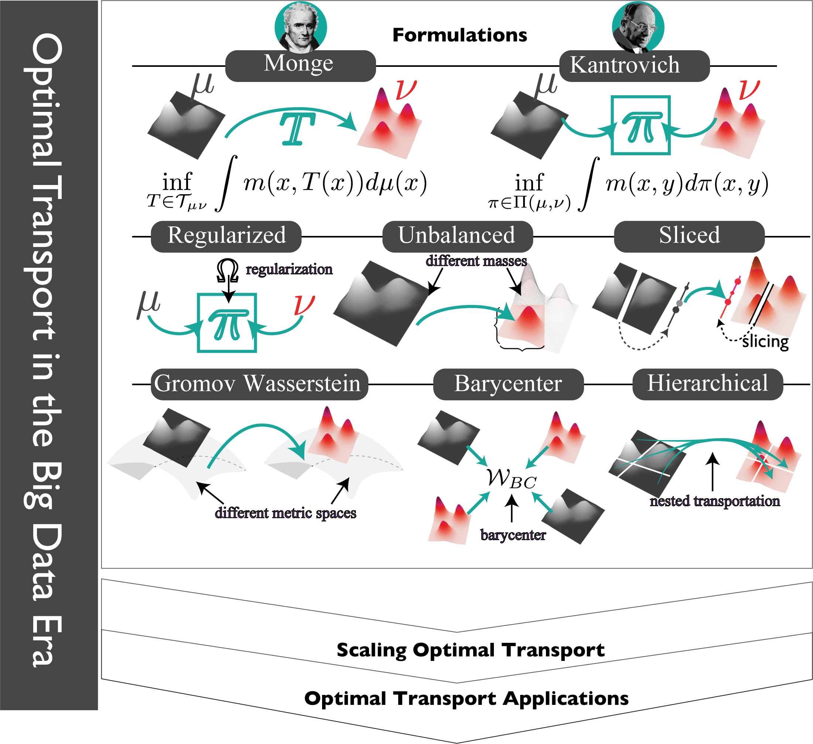

# Optimal Transport in the Big Data Era


<div align="center">
    
</div>


A curated list of research works and resources on optimal transport in machine learning (accompanying the survey [Earth Movers in the Big Data Era]()).

```
@article{khamis2023,
  title={Earth Movers in the Big Data Era: A Review of Optimal Transport in Machine Learning},
  author={Khamis, Abdelwahed and Tsuchida, Russell and Tarek, Mohamed},
  journal={arXiv preprint},
  year={2023}
}
```
Contact: [Abdelwahed Khamis](mailto:abdelwahed.khamis@data61.csiro.au) 

---
## Contents
Overview
- [Review Paper](#Review-Paper)

[comment]: <> (Formulations:)

[comment]: <> (- [Monge-Kantrovich]&#40;#Monge-Kantrovich&#41;)

[comment]: <> (- [Regulaized Optimal Transport]&#40;#Regularized-OT&#41;)

[comment]: <> (- [Partial Optimal Transport]&#40;#Partial-OT&#41;)

[comment]: <> (- [Gromov Wasserstein]&#40;#Gromov-Wasserstein&#41;)

Sections:
- [Formulations](##Formulatins)
  - [GW](##Gromov-Wasserstein)
- [Domain Adaptation](##domain-adaptation)
- [Gneerative Modeling](##generative-modeling)
- [Fairness](##generative-modeling)


---

## Papers List (to be orgnized)
* 2021 - Ota: Optimal transport assignment for object detection __`CVPR`__  [Paper](http://arxiv.org/pdf/2103.14259v1)    [Code](https://github.com/Megvii-BaseDetection/OTA.git)
* 2020 - Margin-aware adversarial domain adaptation with optimal transport __`ICML`__   [Code](https://github.com/sofiendhouib/MADAOT.git)
* 2023 - Watch and match: Supercharging imitation with regularized optimal transport __`CoRL`__  [paper](http://arxiv.org/pdf/2206.15469v2) [Code](https://github.com/siddhanthaldar/ROT.git)
* 2020 - Copt: Coordinated optimal transport on graphs __`NeurIPS`__   [Code](https://github.com/twistedcubic/copt.git)
* 2021 - A regularized wasserstein framework for graph kernels __`ICDM`__  [paper](http://arxiv.org/pdf/2110.02554v2) 
* 2021 - Loftr: Detector-free local feature matching with transformers __`CVPR`__  [paper](http://arxiv.org/pdf/2104.00680v1) [Code](https://github.com/zju3dv/LoFTR.git)
* 2021 - Convex potential flows: Universal probability distributions with optimal transport and convex optimization __`ICLR`__  [paper](http://arxiv.org/pdf/2012.05942v2) 
* 2021 - Wasserstein contrastive representation distillation __`CVPR`__  [paper](http://arxiv.org/pdf/2012.08674v2) 
* 2019 - Obtaining fairness using optimal transport theory __`ICML`__  [paper](http://arxiv.org/pdf/1806.03195v2) [Code](https://github.com/AugustinCombes/optimal-transport-fairness.git)
* 2022 - Optimal transport of classifiers to fairness __`NeurIPS`__  [paper](http://arxiv.org/pdf/2202.03814v3) [Code](https://github.com/aida-ugent/OTF.git)
* 1960 - Mathematical methods of organizing and planning production    
* 2006 - On a problem of monge    
* 2015 - From word embeddings to document distances __`ICML`__   [Code](https://github.com/mkusner/wmd.git)
* 2020 - Speeding up word mover’s distance and its variants via properties of distances between embeddings   [paper?](http://arxiv.org/pdf/1912.00509v2) 
* 2019 - Hierarchical optimal transport for document representation __`NeurIPS`__  [paper](http://arxiv.org/pdf/1906.10827v2) [Code](https://github.com/IBM/HOTT.git)
* 2019 - Learning embeddings into entropic wasserstein spaces __`ICLR`__  [paper](http://arxiv.org/pdf/1905.03329v1) [Code](https://github.com/gabsens/Learning-Embeddings-into-Entropic-Wasserstein-Spaces-ENSAE.git)
* 2017 - Wasserstein generative adversarial networks __`ICML`__   [Code](https://github.com/luslab/arshamg-scrnaseq-wgan.git)
* 2019 - Computational optimal transport: With applications to data science    
* 2022 - Proximal optimal transport modeling of population dynamics __`AISTATS`__  [paper](http://arxiv.org/pdf/2106.06345v4) [Code](https://github.com/bunnech/jkonet.git)
* 2016 - Wasserstein barycentric coordinates: Histogram regression using optimal transport __`ACM ToG`__   
* 2019 - Sharp asymptotic and finite-sample rates of convergence of empirical measures in wasserstein distance   [paper](http://arxiv.org/pdf/1707.00087v1) 
* 2020 - Convergence and concentration of empirical measures under wasserstein distance in unbounded functional spaces   [paper](http://arxiv.org/pdf/1804.10556v2) 
* 2012 - A kernel two-sample test __`JMLR`__   [Code](https://github.com/georgewynne/Kernel-Functional-Data.git)
* 2021 - Outlier-robust optimal transport __`ICML`__   
* 2022 - Order constraints in optimal transport __`ICML`__  [paper](http://arxiv.org/pdf/2110.07275v2) [Code](https://github.com/IBM/otoc.git)
* 2020 - A swiss army knife for minimax optimal transport __`ICML`__   [Code](https://github.com/sofiendhouib/minimax_OT.git)
* 2022 - A brief survey on computational gromov-wasserstein distance    
* 2020 - Fast unbalanced optimal transport on a tree __`NeurIPS`__  [paper](http://arxiv.org/pdf/2006.02703v3) [Code](https://github.com/joisino/treegkr.git)
* 2020 - Rfwash: a weakly supervised tracking of hand hygiene technique    
* 2014 - The canonically posed 3d objects dataset    
* 2015 - Optimal transport for applied mathematicians: calculus of variations, pdes, and modeling    
*  - Optimal transport: old and new    
* 2021 - Topics in optimal transportation    
* 2013 - Sinkhorn Distances: Lightspeed Computation of Optimal Transport __`NeurIPS`__   [Code](https://github.com/sakshigandhi/sinkhorn.git)
* 2021 - Stochastic control liaisons: Richard sinkhorn meets gaspard monge on a schrodinger bridge __`SIAM`__  [paper?](http://arxiv.org/pdf/2005.10963v3) 
* 2021 - Diffusion schrödinger bridge with applications to score-based generative modeling __`NeurIPS`__   
* 2023 - Transport with support: Data-conditional diffusion bridges __`arXiv`__  [paper](http://arxiv.org/pdf/2301.13636v1) 
* 2016 - Optimal transport for domain adaptation __`TPAMI`__  [paper](http://arxiv.org/pdf/1507.00504v2) [Code](https://github.com/Hv0nnus/MLOT.git)
* 2014 - Regularized discrete optimal transport __`SIAM`__  [paper](http://arxiv.org/pdf/1307.5551v1) [Code](https://github.com/gpeyre/2013-SIIMS-regularized-ot.git)
* 2020 - Regularized optimal transport is ground cost adversarial __`ICML`__  [paper](http://arxiv.org/pdf/2002.03967v3) 
* 2008 - The sinkhorn–knopp algorithm: convergence and applications __`SIAM`__   
* 2019 - Massively scalable sinkhorn distances via the nyström method __`NeurIPS`__   
* 2019 - Interpolating between optimal transport and mmd using sinkhorn divergences __`AISTATS`__  [paper](http://arxiv.org/pdf/1810.08278v1) 
* 2019 - Sinkhorn divergences for unbalanced optimal transport __`arXiv`__  [paper](http://arxiv.org/pdf/1910.12958v3) 
* 2019 - Sample complexity of sinkhorn divergences __`AISTATS`__   
* 2020 - Linear time sinkhorn divergences using positive features __`NeurIPS`__  [paper](http://arxiv.org/pdf/2006.07057v3) 
* 2019 - Self-labelling via simultaneous clustering and representation learning __`ICLR`__   [Code](https://github.com/yukimasano/self-label.git)
* 2019 - Wasserstein adversarial examples via projected sinkhorn iterations __`ICML`__  [paper](http://arxiv.org/pdf/1902.07906v2) 
* 2018 - Learning latent permutations with gumbel-sinkhorn networks __`ICLR`__  [paper](http://arxiv.org/pdf/1802.08665v1) [Code](https://github.com/HeddaCohenIndelman/Learning-Gumbel-Sinkhorn-Permutations-w-Pytorch.git)
* 2018 - Visual permutation learning __`TPAMI`__   [Code](https://github.com/rfsantacruz/deep-perm-net.git)
* 2020 - Deep graph matching consensus __`ICLR`__  [paper](http://arxiv.org/pdf/2001.09621v1) [Code](https://github.com/rusty1s/deep-graph-matching-consensus.git)
* 2019 - Differentiable Ranking and Sorting using Optimal Transport __`NeurIPS`__   
* 2011 - Ranking via sinkhorn propagation   [paper](http://arxiv.org/pdf/1106.1925v2) 
* 2022 - Sinkformers: Transformers with doubly stochastic attention __`AISTATS`__  [paper](http://arxiv.org/pdf/2110.11773v2) 
* 2014 - Optimal transport with laplacian regularization __`NeurIPS`__   
* 2018 - Smooth and sparse optimal transport __`AISTATS`__  [paper](http://arxiv.org/pdf/1710.06276v2) 
* 2017 - Order-preserving wasserstein distance for sequence matching __`CVPR`__   
* 2022 - Unsupervised action segmentation by joint representation learning and online clustering __`CVPR`__  [paper](http://arxiv.org/pdf/2105.13353v6) 
* 2019 - Stabilized sparse scaling algorithms for entropy regularized transport problems __`SIAM`__  [paper](http://arxiv.org/pdf/1610.06519v2) 
* 2021 - Unbalanced optimal transport in multi-camera tracking applications    
* 2021 - Learning to count via unbalanced optimal transport __`AAAI`__   
* 2021 - A generalized loss function for crowd counting and localization __`CVPR`__   [Code](https://github.com/jia-wan/GeneralizedLoss-Counting-Pytorch.git)
* 2018 - Unbalanced optimal transport: Dynamic and kantorovich formulations   [paper?](http://arxiv.org/pdf/1508.05216v3) 
* 2018 - Optimal entropy-transport problems and a new hellinger–kantorovich distance between positive measures    
* 2022 - Unbalanced optimal transport, from theory to numerics __`arXiv`__  [paper](http://arxiv.org/pdf/2211.08775v2) 
* 2020 - MMD-regularized Unbalanced Optimal Transport __`arXiv`__   
* 2020 - Learning 3d-3d correspondences for one-shot partial-to-partial registration __`arXiv`__   
* 2020 - Superglue: Learning feature matching with graph neural networks __`CVPR`__   [Code](https://github.com/magicleap/SuperGluePretrainedNetwork.git)
* 2020 - Partial optimal tranport with applications on positive-unlabeled learning __`NeurIPS`__   
* 2020 - Learning 3d-3d correspondences for one-shot partial-to-partial registration __`arXiv`__   
* 2020 - On unbalanced optimal transport: An analysis of sinkhorn algorithm __`ICML`__  [paper](http://arxiv.org/pdf/2002.03293v2) [Code](https://github.com/lntk/uot.git)
* 2013 - Unidimensional and evolution methods for optimal transportation    
* 2019 - Asymptotic guarantees for learning generative models with the sliced-wasserstein distance __`NeurIPS`__  [paper](http://arxiv.org/pdf/1906.04516v2) 
* 2019 - Strong equivalence between metrics of wasserstein type __`arXiv`__  [paper](http://arxiv.org/pdf/1912.08247v3) 
* 2020 - Statistical and topological properties of sliced probability divergences __`NeurIPS`__  [paper](http://arxiv.org/pdf/2003.05783v3) 
* 2016 - Sliced wasserstein kernels for probability distributions __`CVPR`__  [paper](http://arxiv.org/pdf/1511.03198v1) 
* 2019 - Max-sliced wasserstein distance and its use for gans __`CVPR`__  [paper](http://arxiv.org/pdf/1904.05877v1) 
* 2021 - A sliced wasserstein loss for neural texture synthesis __`CVPR`__  [paper](http://arxiv.org/pdf/2006.07229v4) [Code](https://github.com/tchambon/A-Sliced-Wasserstein-Loss-for-Neural-Texture-Synthesis.git)
* 2021 - Pooling by sliced-wasserstein embedding __`NeurIPS`__   [Code](https://github.com/navid-naderi/PSWE.git)
* 2021 - Model selection for bayesian autoencoders __`NeurIPS`__  [paper](http://arxiv.org/pdf/2106.06245v1) [Code](https://github.com/tranbahien/bae-prior.git)
* 2021 - Point-set distances for learning representations of 3d point clouds __`ICCV`__  [paper](http://arxiv.org/pdf/2102.04014v2) [Code](https://github.com/VinAIResearch/PointSWD.git)
* 2019 - Sliced wasserstein discrepancy for unsupervised domain adaptation __`CVPR`__  [paper](http://arxiv.org/pdf/1903.04064v1) [Code](https://github.com/apple/ml-cvpr2019-swd.git)
* 2015 - Sliced and radon wasserstein barycenters of measures    [Code](https://github.com/gpeyre/2014-JMIV-SlicedTransport.git)
* 2019 - Sliced gromov-wasserstein __`NeurIPS`__   [Code](https://github.com/tvayer/SGW.git)
* 2013 - Evaluation of traffic sign recognition methods trained on synthetically generated data    
* 2011 - The german traffic sign recognition benchmark: a multi-class classification competition    [Code](https://github.com/ivinable2000/Traffic-Sign-AI.git)
* 2021 - Distributional sliced-wasserstein and applications to generative modeling __`ICLR`__   
* 2019 - Generalized sliced wasserstein distances __`NeurIPS`__  [paper](http://arxiv.org/pdf/1902.00434v1) 
* 2011 - Barycenters in the wasserstein space __`SIAM`__   
* 2020 - Debiased sinkhorn barycenters __`ICML`__  [paper](http://arxiv.org/pdf/2006.02575v1) 
* 2021 - Scalable computations of wasserstein barycenter via input convex neural networks __`ICML`__  [paper](http://arxiv.org/pdf/2007.04462v3) 
* 2021 - The right to talk: An audio-visual transformer approach __`ICCV`__   [Code](https://github.com/uark-cviu/Right2Talk.git)
* 2018 - Gromov-wasserstein alignment of word embedding spaces __`EMNLP`__   
* 1981 - Groups of polynomial growth and expanding maps    
* 2011 - Gromov–wasserstein distances and the metric approach to object matching    
* 2020 - A contribution to optimal transport on incomparable spaces   [paper](http://arxiv.org/pdf/2011.04447v1) 
* 2019 - Learning generative models across incomparable spaces __`ICML`__  [paper](http://arxiv.org/pdf/1905.05461v2) [Code](https://github.com/bunnech/gwgan.git)
* 2020 - Gromov-Wasserstein Optimal Transport to Align Single-Cell Multi-Omics Data __`ICML`__   
* 2022 - Cross-domain imitation learning via optimal transport __`ICLR`__  [paper](http://arxiv.org/pdf/2110.03684v3) [Code](https://github.com/facebookresearch/gwil.git)
* 2021 - Aligning time series on incomparable spaces __`AISTATS`__  [paper](http://arxiv.org/pdf/2006.12648v2) 
* 2019 - Optimal transport for structured data with application on graphs __`ICML`__  [paper](http://arxiv.org/pdf/1805.09114v3) [Code](https://github.com/tvayer/FGW.git)
* 2017 - Multiscale strategies for computing optimal transport __`JMLR`__  [paper](http://arxiv.org/pdf/1708.02469v1) [Code](https://github.com/KitwareMedicalPublications/2017-JMLR-OptimalTransport.git)
* 2011 - A multiscale approach to optimal transport    
* 2019 - Scalable gromov-wasserstein learning for graph partitioning and matching __`NeurIPS`__  [paper](http://arxiv.org/pdf/1905.07645v5) [Code](https://github.com/HongtengXu/s-gwl.git)
* 2019 - Gromov-wasserstein learning for graph matching and node embedding __`ICML`__  [paper](http://arxiv.org/pdf/1901.06003v2) [Code](https://github.com/HongtengXu/gwl.git)
* 2022 - Learning to predict graphs with fused gromov-wasserstein barycenters __`ICML`__  [paper](http://arxiv.org/pdf/2202.03813v3) 
* 2016 - Gromov-wasserstein averaging of kernel and distance matrices __`ICML`__   [Code](https://github.com/gpeyre/2016-ICML-gromov-wasserstein.git)
* 2019 - Hierarchical optimal transport for multimodal distribution alignment __`NeurIPS`__  [paper](http://arxiv.org/pdf/1906.11768v2) 
* 2020 - Transporting labels via hierarchical optimal transport for semi-supervised learning __`ICCV`__   
* 2020 - Geometric dataset distances via optimal transport __`NeurIPS`__  [paper](http://arxiv.org/pdf/2002.02923v1) [Code](https://github.com/kheyer/OTDD.git)
* 2022 - Hierarchical optimal transport for unsupervised domain adaptation   [paper](http://arxiv.org/pdf/2112.02073v1) [Code](https://github.com/MouradElHamri/HOT-DA.git)
* 2021 - Rates of estimation of optimal transport maps using plug-in estimators via barycentric projections __`NeurIPS`__  [paper](http://arxiv.org/pdf/2107.01718v1) 
* 2021 - Plugin estimation of smooth optimal transport maps __`arXiv`__  [paper](http://arxiv.org/pdf/2107.12364v2) 
* 1969 - The speed of mean glivenko-cantelli convergence    
* 2022 - Estimation of wasserstein distances in the spiked transport model   [paper](http://arxiv.org/pdf/1909.07513v1) 
* 2021 - A short proof on the rate of convergence of the empirical measure for the wasserstein distance __`arXiv`__  [paper](http://arxiv.org/pdf/2101.08126v1) 
* 2022 - Entropy-regularized 2-wasserstein distance between gaussian measures    
* 2020 - The statistical effect of entropic regularization in optimal transportation __`arXiv`__  [paper](http://arxiv.org/pdf/2006.05199v2) 
* 2020 - Entropic optimal transport between unbalanced gaussian measures has a closed form __`NeurIPS`__  [paper](http://arxiv.org/pdf/2006.02572v2) 
* 2022 - Entropic gromov-wasserstein between gaussian distributions __`ICML`__  [paper](http://arxiv.org/pdf/2108.10961v3) 
* 2023 - Approximating 1-wasserstein distance with trees __`TMLR`__  [paper](http://arxiv.org/pdf/2206.12116v1) 
* 2021 - Supervised tree-wasserstein distance __`ICML`__  [paper](http://arxiv.org/pdf/2101.11520v2) 
* 2022 - Fixed support tree-sliced wasserstein barycenter __`AISTATS`__  [paper](http://arxiv.org/pdf/2109.03431v2) [Code](https://github.com/yukiTakezawa/FS_TSWB.git)
* 2019 - Tree-sliced variants of wasserstein distances __`NeurIPS`__  [paper](http://arxiv.org/pdf/1902.00342v3) [Code](https://github.com/lttam/TreeWasserstein.git)
* 2021 - Pot: Python optimal transport __`JMLR`__   [Code](https://github.com/PythonOT/POT.git)
* 2022 - Supervised training of conditional monge maps __`NeurIPS`__  [paper](http://arxiv.org/pdf/2206.14262v2) 
* 2021 - Averaging on the bures-wasserstein manifold: dimension-free convergence of gradient descent __`NeurIPS`__   
* 2022 - Wasserstein iterative networks for barycenter estimation __`NeurIPS`__  [paper](http://arxiv.org/pdf/2201.12245v2) [Code](https://github.com/iamalexkorotin/WassersteinIterativeNetworks.git)
* 2020 - Gaussian-smoothed optimal transport: Metric structure and statistical efficiency __`AISTATS`__   
* 2022 - Asymptotics of smoothed wasserstein distances in the small noise regime __`NeurIPS`__  [paper](http://arxiv.org/pdf/2206.06452v1) 
* 2021 - Differentially private sliced wasserstein distance __`ICML`__  [paper](http://arxiv.org/pdf/2107.01848v1) 
* 2020 - Asymptotic guarantees for generative modeling based on the smooth wasserstein distance __`NeurIPS`__  [paper](http://arxiv.org/pdf/2002.01012v4) 
* 2020 - Convergence of smoothed empirical measures with applications to entropy estimation __`IEEE TIT`__  [paper](http://arxiv.org/pdf/1905.13576v3) 
* 2019 - Subspace robust wasserstein distances __`ICML`__  [paper](http://arxiv.org/pdf/1901.08949v5) [Code](https://github.com/francoispierrepaty/SubspaceRobustWasserstein.git)
* 2021 - Dimensionality reduction for wasserstein barycenter __`NeurIPS`__  [paper](http://arxiv.org/pdf/2110.08991v2) 
* 2021 - Projection robust wasserstein barycenters __`ICML`__  [paper](http://arxiv.org/pdf/2102.03390v4) 
* 2019 - Subspace detours: Building transport plans that are optimal on subspace projections __`NeurIPS`__  [paper](http://arxiv.org/pdf/1905.10099v4) 
* 2021 - Subspace detours meet gromov–wasserstein   [paper?](http://arxiv.org/pdf/2110.10932v1) 
* 2023 - Feature-robust optimal transport for high-dimensional data __`ECML PKDD`__   
* 2019 - Large-scale optimal transport map estimation using projection pursuit __`NeurIPS`__  [paper](http://arxiv.org/pdf/2106.05838v1) [Code](https://github.com/ChengzijunAixiaoli/PPMM.git)
* 2022 - Projection-based techniques for high-dimensional optimal transport problems    
* 2021 - Improving approximate optimal transport distances using quantization __`UAI`__  [paper](http://arxiv.org/pdf/2102.12731v2) 
* 2022 - Quantized wasserstein procrustes alignment of word embedding spaces __`AMTA`__  [paper](http://arxiv.org/pdf/2212.02468v1) 
* 2021 - Low-rank sinkhorn factorization __`ICML`__  [paper](http://arxiv.org/pdf/2103.04737v1) 
* 2021 - Approximating optimal transport via low-rank and sparse factorization __`arXiv`__  [paper](http://arxiv.org/pdf/2111.06546v1) 
* 2020 - Empirical regularized optimal transport: Statistical theory and applications __`SIAM`__  [paper](http://arxiv.org/pdf/1810.09880v3) 
* 2017 - Linear-complexity relaxed word mover's distance with gpu acceleration   [paper](http://arxiv.org/pdf/1711.07227v1) 
* 2019 - Stabilized sparse scaling algorithms for entropy regularized transport problems __`SIAM`__  [paper](http://arxiv.org/pdf/1610.06519v2) 
* 2020 - A fast proximal point method for computing exact wasserstein distance __`UAI`__  [paper](http://arxiv.org/pdf/1802.04307v3) 
* 2019 - Statistical optimal transport via factored couplings __`AISTATS`__  [paper](http://arxiv.org/pdf/1806.07348v3) 
* 2021 - Making transport more robust and interpretable by moving data through a small number of anchor points   [paper](http://arxiv.org/pdf/2012.11589v3) 
* 2022 - Low-rank optimal transport: Approximation, statistics and debiasing __`NeurIPS`__   
* 2020 - Faster wasserstein distance estimation with the sinkhorn divergence __`NeurIPS`__  [paper](http://arxiv.org/pdf/2006.08172v2) [Code](https://github.com/leoHeidel/OT-numerics.git)
* 2022 - Accelerating fixed-point algorithms in statistics and data science: A state-of-art review    
* 2023 - Rethinking initialization of the sinkhorn algorithm __`AISTATS`__  [paper](http://arxiv.org/pdf/2206.07630v2) 
* 2009 - Fast and robust earth mover's distances __`ICCV`__   
* 2020 - Multi-marginal optimal transport using partial information with applications in robust localization and sensor fusion    
* 2021 - Multimarginal optimal transport with a tree-structured cost and the schrodinger bridge problem __`SIAM`__   
* 2022 - Computing wasserstein-p distance between images with linear cost __`CVPR`__   
* 1989 - On the scaling of multidimensional matrices    
* 2000 - Using the nyström method to speed up kernel machines __`NeurIPS`__   
* 2021 - Scalable optimal transport in high dimensions for graph distances, embedding alignment, and more __`ICML`__  [paper](http://arxiv.org/pdf/2107.06876v2) [Code](https://github.com/gasteigerjo/lcn.git)
* 2014 - Hashing for similarity search: A survey __`arXiv`__  [paper](http://arxiv.org/pdf/1408.2927v1) 
* 2020 - Mrec: a fast and versatile framework for aligning and matching point clouds with applications to single cell molecular data __`arXiv`__  [paper](http://arxiv.org/pdf/2001.01666v3) 
* 2021 - Quantized gromov-wasserstein __`ECML PKDD`__   [Code](https://github.com/trneedham/QuantizedGromovWasserstein.git)
* 2018 - Sketching and clustering metric measure spaces __`arXiv`__  [paper](http://arxiv.org/pdf/1801.00551v2) 
* 2018 - Fluid communities: A competitive, scalable and diverse community detection algorithm   [paper](http://arxiv.org/pdf/1703.09307v3) 
* 1998 - The anatomy of a large-scale hypertextual web search engine    [Code](https://github.com/ZdsAlpha/SearchEngine.git)
* 2019 - Optimal transport: Fast probabilistic approximation with exact solvers.   [paper?](http://arxiv.org/pdf/1802.05570v4) 
* 2022 - Budget-constrained bounds for mini-batch estimation of optimal transport __`arXiv`__   
* 2021 - Deep learning and optimal transport: learning from one another    
* 2020 - Learning with minibatch wasserstein: asymptotic and gradient properties __`AISTATS`__   [Code](https://github.com/kilianFatras/minibatch_Wasserstein.git)
* 2021 - Unbalanced minibatch optimal transport; applications to domain adaptation __`ICML`__  [paper](http://arxiv.org/pdf/2103.03606v1) [Code](https://github.com/kilianFatras/JUMBOT.git)
* 2017 - Overrelaxed sinkhorn-knopp algorithm for regularized optimal transport __`NeurIPS`__  [paper](http://arxiv.org/pdf/1711.01851v2) 
* 2019 - Quantum entropic regularization of matrix-valued optimal transport    
* 2021 - A note on overrelaxation in the sinkhorn algorithm   [paper](http://arxiv.org/pdf/2012.12562v3) 
* 2022 - Efficient optimal transport algorithm by accelerated gradient descent __`AAAI`__  [paper](http://arxiv.org/pdf/2104.05802v2) 
* 2018 - Computational optimal transport: Complexity by accelerated gradient descent is better than by sinkhorn’s algorithm __`ICML`__  [paper?](http://arxiv.org/pdf/1802.04367v2) 
* 2016 - A smoothed dual approach for variational wasserstein problems __`SIAM`__  [paper](http://arxiv.org/pdf/1503.02533v2) [Code](https://github.com/gpeyre/2015-SIIMS-wasserstein-dual.git)
* 2021 - Wasserstein gans work because they fail (to approximate the wasserstein distance) __`arXiv`__  [paper](http://arxiv.org/pdf/2103.01678v4) 
* 2021 - Do neural optimal transport solvers work? a continuous wasserstein-2 benchmark __`NeurIPS`__  [paper](http://arxiv.org/pdf/2106.01954v2) 
* 2020 - Continuous regularized wasserstein barycenters __`NeurIPS`__  [paper](http://arxiv.org/pdf/2008.12534v2) [Code](https://github.com/lingxiaoli94/CWB.git)
* 2018 - Large-scale optimal transport and mapping estimation __`ICLR`__   [Code](https://github.com/mikigom/large-scale-OT-mapping-TF.git)
* 2020 - Optimal transport mapping via input convex neural networks __`ICML`__  [paper](http://arxiv.org/pdf/1908.10962v2) 
* 2021 - The many faces of 1-lipschitz neural networks __`arXiv`__   
* 2022 - A dynamical system perspective for lipschitz neural networks __`ICML`__  [paper](http://arxiv.org/pdf/2110.12690v2) 
* 2017 - Input convex neural networks __`ICML`__  [paper](http://arxiv.org/pdf/1609.07152v3) [Code](https://github.com/locuslab/icnn.git)
* 2021 - Convex transport potential selection with semi-dual criterion __`arXiv`__   
* 2020 - Wasserstein-2 generative networks __`ICLR`__  [paper](http://arxiv.org/pdf/1909.13082v4) [Code](https://github.com/iamalexkorotin/Wasserstein2GenerativeNetworks.git)
* 2012 - The implicit function theorem: History, theory, and applications    
* 2021 - Algorithm unrolling: Interpretable, efficient deep learning for signal and image processing   [paper](http://arxiv.org/pdf/1912.10557v3) 
* 2019 - Deep equilibrium models __`NeurIPS`__  [paper](http://arxiv.org/pdf/1909.01377v2) [Code](https://github.com/locuslab/deq.git)
* 2021 - Deep declarative networks __`TPAMI`__   [Code](https://github.com/anucvml/ddn.git)
* 2020 - Solving the blind perspective-n-point problem end-to-end with robust differentiable geometric optimization __`ECCV`__  [paper](http://arxiv.org/pdf/2007.14628v2) [Code](https://github.com/dylan-campbell/bpnpnet.git)
* 2022 - A unified framework for implicit sinkhorn differentiation __`CVPR`__  [paper](http://arxiv.org/pdf/2205.06688v1) 
* 2020 - Deepemd: Few-shot image classification with differentiable earth mover's distance and structured classifiers __`CVPR`__   [Code](https://github.com/icoz69/DeepEMD.git)
* 2022 - Exploiting problem structure in deep declarative networks: Two case studies __`AAAI`__  [paper](http://arxiv.org/pdf/2202.12404v1) 
* 2022 - Efficient and modular implicit differentiation __`NeurIPS`__  [paper](http://arxiv.org/pdf/2105.15183v5) 
* 2019 - Optimal control via neural networks: A convex approach __`ICLR`__  [paper](http://arxiv.org/pdf/1805.11835v5) [Code](https://github.com/chennnnnyize-zz/Optimal-Control-via-Neural-Networks.git)
* 2021 - Input convex gradient networks __`arXiv`__  [paper](http://arxiv.org/pdf/2111.12187v1) 
* 2016 - Stochastic optimization for large-scale optimal transport __`NeurIPS`__   [Code](https://github.com/kilianFatras/stochastic_opt_OT.git)
* 2022 - Linear-time gromov wasserstein distances using low rank couplings and costs __`ICML`__  [paper](http://arxiv.org/pdf/2106.01128v2) 
* 2022 - Gromov-wasserstein autoencoders __`arXiv`__   [Code](https://github.com/ganmodokix/gwae.git)
* 2022 - Motion-modulated temporal fragment alignment network for few-shot action recognition __`CVPR`__   
* 2022 - Model-based deep learning: On the intersection of deep learning and optimization   [paper](http://arxiv.org/pdf/2205.02640v2) 
* 2022 - Learning to optimize: A primer and a benchmark __`JMLR`__   
* 2022 - Tutorial on amortized optimization for learning to optimize over continuous domains __`arXiv`__   [Code](https://github.com/facebookresearch/amortized-optimization-tutorial.git)
* 2022 - Meta optimal transport __`arXiv`__  [paper](http://arxiv.org/pdf/2206.05262v1) [Code](https://github.com/facebookresearch/meta-ot.git)
* 2023 - Learning to generate wasserstein barycenters   [paper](http://arxiv.org/pdf/2102.12178v1) [Code](https://github.com/jlacombe/learning-to-generate-wasserstein-barycenters.git)
* 2020 - A study of performance of optimal transport __`arXiv`__   [Code](https://github.com/twistedcubic/fast_ot.git)
* 2022 - Kantorovich strikes back! wasserstein gans are not optimal transport?    
* 2020 - Unsupervised hierarchy matching with optimal transport over hyperbolic spaces __`AISTATS`__  [paper](http://arxiv.org/pdf/1911.02536v2) 
* 2020 - Model fusion via optimal transport __`NeurIPS`__  [paper](http://arxiv.org/pdf/1910.05653v5) [Code](https://github.com/sidak/otfusion.git)
* 2020 - Federated learning: Challenges, methods, and future directions   [paper](http://arxiv.org/pdf/1908.07873v1) 
* 2023 - Personalised federated learning on heterogeneous feature spaces __`arXiv`__  [paper](http://arxiv.org/pdf/2301.11447v1) 
* 2022 - Optimal transport tools (ott): A jax toolbox for all things wasserstein __`arXiv`__   
* 2020 - Fast geometric learning with symbolic matrices __`NeurIPS`__   
* 2018 - Semidual regularized optimal transport __`SIAM`__   
* 1992 - Kantorovich-rubinstein norm and its application in the theory of lipschitz spaces    
* 2010 - Adapting visual category models to new domains __`ICCV`__   
* 2022 - Generalizing to unseen domains: A survey on domain generalization    
* 2021 - Generalized out-of-distribution detection: A survey __`arXiv`__   
* 2020 - A survey on domain adaptation theory: learning bounds and theoretical guarantees __`arXiv`__  [paper](http://arxiv.org/pdf/2004.11829v6) 
* 2017 - Theoretical analysis of domain adaptation with optimal transport __`ECML PKDD`__  [paper](http://arxiv.org/pdf/1610.04420v4) 
* 2021 - Measuring generalization with optimal transport __`NeurIPS`__   [Code](https://github.com/chingyaoc/kV-Margin.git)
* 2021 - Lifelong domain adaptation via consolidated internal distribution __`NeurIPS`__   
* 2020 - Co-optimal transport __`NeurIPS`__   [Code](https://github.com/PythonOT/COOT.git)
* 2020 - A comprehensive survey on transfer learning   [paper](http://arxiv.org/pdf/1911.02685v3) 
* 2021 - Scalable diverse model selection for accessible transfer learning __`NeurIPS`__  [paper](http://arxiv.org/pdf/2111.06977v2) [Code](https://github.com/dbolya/parc.git)
* 2021 - Otce: A transferability metric for cross-domain cross-task representations __`CVPR`__   [Code](https://github.com/tanyang1231/OTCE_Transferability_CVPR21.git)
* 2019 - Transferability and hardness of supervised classification tasks __`ICCV`__  [paper](http://arxiv.org/pdf/1908.08142v1) 
* 2019 - An information-theoretic approach to transferability in task transfer learning __`ICIP`__  [paper](http://arxiv.org/pdf/2212.10082v1) 
* 2020 - Leep: A new measure to evaluate transferability of learned representations __`ICML`__  [paper](http://arxiv.org/pdf/2002.12462v2) [Code](https://github.com/CrimsonRadiator/LEEP-Pytorch.git)
* 2018 - Taskonomy: Disentangling task transfer learning __`CVPR`__   [Code](https://github.com/StanfordVL/taskonomy.git)
* 2018 - Maximum classifier discrepancy for unsupervised domain adaptation __`CVPR`__  [paper](http://arxiv.org/pdf/1712.02560v4) [Code](https://github.com/Nyn-ynu/MCD.git)
* 2018 - Wasserstein distance guided representation learning for domain adaptation __`AAAI`__  [paper](http://arxiv.org/pdf/1707.01217v4) 
* 2016 - Domain-adversarial training of neural networks __`JMLR`__   [Code](https://github.com/fungtion/DANN.git)
* 2019 - Optimal transport for multi-source domain adaptation under target shift __`AISTATS`__  [paper](http://arxiv.org/pdf/1803.04899v3) [Code](https://github.com/ievred/JCPOT.git)
* 2009 - Domain adaptation: Learning bounds and algorithms    
* 2018 - Generalizing across domains via cross-gradient training __`ICLR`__  [paper](http://arxiv.org/pdf/1804.10745v2) [Code](https://github.com/gpascualg/CrossGrad.git)
* 2020 - Learning to generate novel domains for domain generalization __`ECCV`__   [Code](https://github.com/mousecpn/L2A-OT.git)
* 2017 - Open set domain adaptation __`ICCV`__  [paper](http://openaccess.thecvf.com/content_iccv_2017/html/Busto_Open_Set_Domain_ICCV_2017_paper.html) [Code](https://github.com/iCGY96/awesome_OpenSetRecognition_list.git)
* 2020 - Joint partial optimal transport for open set domain adaptation. __`IJCAI`__  [paper](https://www.ijcai.org/proceedings/2020/0352.pdf) 
* 2010 - A survey on transfer learning    
* 2018 - Deepjdot: Deep joint distribution optimal transport for unsupervised domain adaptation __`ICCV`__  [paper](http://arxiv.org/pdf/1803.10081v3) 
* 2022 - Few-shot domain adaptation via mixup optimal transport __`IEEE TIP`__  [paper](https://ieeexplore.ieee.org/abstract/document/9733175/) 
* 2021 - Zero-shot recognition via optimal transport   [paper](http://arxiv.org/pdf/1910.09057v2) 
* 2021 - A continual learning survey: Defying forgetting in classification tasks __`TPAMI`__  [paper](https://openreview.net/pdf?id=PdMgx9P7LJc) [Code](https://github.com/Mattdl/CLsurvey.git)
* 2020 - Weakly supervised cross-domain alignment with optimal transport   [paper](http://arxiv.org/pdf/2008.06597v1) 
* 2021 - A survey on federated learning systems: vision, hype and reality for data privacy and protection   [paper](https://ieeexplore.ieee.org/abstract/document/9599369/) 
* 2021 - Augmented self-labeling for source-free unsupervised domain adaptation   [paper](https://openreview.net/forum?id=c_XaCsX3gtA) 
* 2017 - Unpaired image-to-image translation using cycle-consistent adversarial networks __`ICCV`__   [Code](https://github.com/adepierre/Caffe_CycleGAN.git)
* 2022 - Towards explaining distribution shifts __`arXiv`__  [paper](http://arxiv.org/abs/2210.10275) [Code](https://github.com/inouye-lab/explaining-distribution-shifts.git)
* 2022 - Towards explaining image-based distribution shifts __`CVPR`__  [paper](https://openaccess.thecvf.com/content/CVPR2022W/VDU/html/Kulinski_Towards_Explaining_Image-Based_Distribution_Shifts_CVPRW_2022_paper.html) 
* 2017 - Joint distribution optimal transportation for domain adaptation __`NeurIPS`__  [paper](http://arxiv.org/pdf/1705.08848v2) [Code](https://github.com/rflamary/JDOT.git)
* 2014 - Understanding machine learning: From theory to algorithms    [Code](https://github.com/zahta/exercises-understanding-machine-learning.git)
* 2014 - Generative adversarial nets __`NeurIPS`__  [paper](https://proceedings.neurips.cc/paper/5423-generative-adversarial-nets) [Code](https://github.com/zhangqianhui/AdversarialNetsPapers.git)
* 2017 - From optimal transport to generative modeling: the vegan cookbook   [paper](http://arxiv.org/pdf/1705.07642v1) 


